# 📋 Product Requirements Document (PRD)

<!-- ⎯⎯⎯⎯⎯⎯⎯⎯⎯⎯⎯⎯⎯⎯⎯⎯ PROJECT METADATA ⎯⎯⎯⎯⎯⎯⎯⎯⎯⎯⎯⎯⎯⎯⎯⎯ -->

🏷️ Project Name - ProjectFlo - The Creative OS  
🔢 Version - 1.0  
🗓️ Date - 11 June 2025

<!-- ⎯⎯⎯⎯⎯⎯⎯⎯⎯⎯⎯⎯⎯⎯⎯⎯ INTRODUCTION ⎯⎯⎯⎯⎯⎯⎯⎯⎯⎯⎯⎯⎯⎯⎯⎯ -->

## 1. Purpose & Scope 🎯

This document details the complete functional and non-functional requirements for ProjectFlo v1.0. Its purpose is to serve as the definitive guide for the engineering, design, and quality assurance teams.

> **Key Objective:**  
> Translate strategic vision into concrete, actionable development requirements while maintaining alignment with business goals.

---

## 2. Guiding Principles ✨

Our design and development are guided by four foundational principles. Adherence to these principles is mandatory for all features.

### **Single Source of Truth**

All data must have a single, canonical location in the database. Data entered once must be seamlessly available wherever it's needed without duplication.

> **Implication:** This eliminates data-entry errors, resolves version control issues (e.g., "Which proposal is correct?"), and ensures that when core information is updated in one place, it is correct everywhere.

### **Automate Everything Repetitive**

If a task is performed manually more than twice, it must be considered a prime candidate for automation. Our team's time should be spent on high-impact, creative work, not rote administration.

> **Implication:** The system will actively take work off our team's plate, from generating task lists based on a quote to sending payment reminders, thereby increasing operational leverage and scalability.

### **Data-Driven by Default**

The system must not be a passive data repository. It must actively use the data it collects to provide actionable insights, improve estimates, and flag risks. Every feature should be designed with the question, "How can this data make us smarter?"

> **Implication:** The platform will evolve into a predictive tool, helping us forecast project profitability, identify our most efficient team members for specific tasks, and understand the true cost of our services.

### **User-Centric Design**

Every feature must provide clear, tangible value to at least one of our core user roles. The user experience must be intuitive, efficient, and empowering.

> **Implication:** The success of a feature is measured by its adoption and the value it delivers to the end-user, whether it's a client feeling informed or a contributor feeling unblocked.

---

## 3. Core User Roles 🎭

ProjectFlo is designed around the distinct needs of three primary user personas.

### 🤝 The Client

- **Identity:** The end customer, investing significant money and emotion into our services.
- **Needs:** Craves transparency, convenience, and confidence that their vision is being executed flawlessly.
- **Pain Points:** Feeling "in the dark" about progress, confusion over pricing changes, and managing communication across endless email threads.
- **Success Looks Like:** A seamless, intuitive online portal where they can see everything in one place—their package, the timeline, payments—and feel like an empowered, collaborative partner.

### 👑 The Administrator

- **Identity:** The internal power user (Project Manager, Owner) responsible for the health of the business.
- **Needs:** Driven by efficiency, profitability, and control. Needs to reduce administrative drag and have a high-level view of the entire business.
- **Pain Points:** Wasting time on manual data entry, "gut-feel" quoting, an inability to see projects at financial risk, and constantly chasing information.
- **Success Looks Like:** A central command center that automates repetitive work, provides at-a-glance dashboards of the sales pipeline and project health, and offers data to make smart, profitable decisions.

### 🎬 The Contributor

- **Identity:** The internal production team member (Editor, Videographer) performing the hands-on creative work.
- **Needs:** Driven by clarity, efficiency, and a desire to focus on their craft without unnecessary interruptions.
- **Pain Points:** Ambiguous creative briefs, time wasted searching for files, and the tedious overhead of manual time tracking.
- **Success Looks Like:** A personalized dashboard showing clear priorities. A workspace that provides all context and assets upfront, allowing them to get into a creative flow state.

---

## 4. Core Automation & Intelligence 🧠

Beyond direct user actions, the system must perform the following automated functions. These are not optional features; they are core to the platform's value proposition.

### 🤖 Automated Quoting Engine

This is the heart of the sales process. When a client or admin uses the configurator, the system must instantly calculate a preliminary quote.

> **Logic:** It will read from the `component_task_recipes` table to determine the required `task_templates` for selected items. It then fetches `effort_hours` for each task and calculates the cost based on rates in the `operator_types` table.
> **Business Impact:** This eliminates manual quoting errors, ensures consistency, and allows for instant price feedback, dramatically accelerating the sales cycle.

### ❤️‍🩹 Proactive Project Health Monitoring

The system will act as a vigilant project manager, running a scheduled job nightly to check on all active projects.

> **Logic:** The job will flag projects based on:
>
> - 🚨 **Overdue Tasks:** `due_date` is in the past and `status` is not 'Completed'.
> - 💸 **Budget Risk:** `actual_duration_hours` exceeds `planned_duration_hours` by a configurable threshold (e.g., 20%).
> - 🤔 **Stalled Tasks:** `status` is 'To-Do' and unassigned for more than 3 business days.
>   **Business Impact:** This moves us from a reactive to a proactive management style, allowing us to address problems before they escalate and impact deadlines or profitability.

### 📈 Foundational Data for Analysis

The system must be engineered from day one to build a rich dataset for future business intelligence.

> **Logic:** The application will use the `audit_log` table to record key events, status changes (e.g., 'To-Do' to 'In Progress'), and durations with precise timestamps. Every significant state change must be captured.
> **Business Impact:** This provides the raw material for all future reporting and analytics. This data will be instrumental for identifying our most profitable services, optimizing team performance, and building predictive models.

---

## 5. System Context Diagram 🗺️

This diagram shows how ProjectFlo interacts with external services. It is not an internal architecture diagram.

```mermaid
graph TD
    subgraph "ProjectFlo Ecosystem"
        PF[ProjectFlo Platform]
    end

    subgraph "Users"
        Client[🤝 Client]
        Admin[👑 Admin / 🎬 Contributor]
    end

    subgraph "External Services"
        Stripe(💳 Stripe for Payments)
        Clockify(⏱️ Clockify for Time Sync)
        FrameIO(🖼️ Frame.io for Asset Links)
        Google(📄 G Suite / Drive for Storage & Email)
        LLM[🧠 Large Language Model API]
    end

    Client -->|Interacts with Client Portal via HTTPS| PF
    Admin -->|Interacts with Admin UI via HTTPS| PF

    PF -->|Secure API Calls| Stripe
    PF -->|Secure API Calls| Clockify
    PF -->|Secure API Calls| FrameIO
    PF -->|Secure API Calls| Google
    PF -->|Secure API Calls| LLM
```

