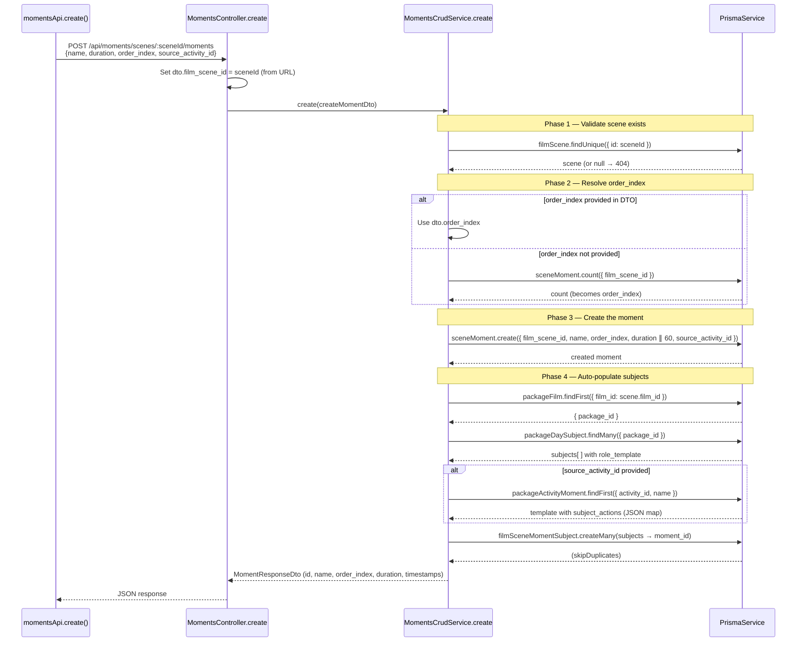
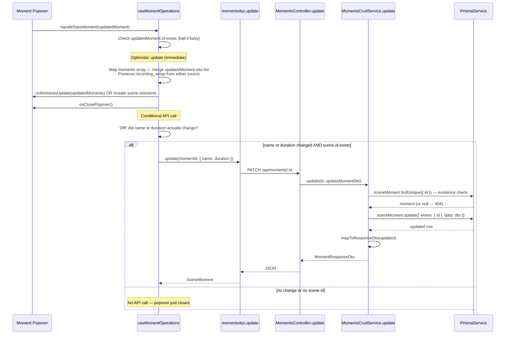
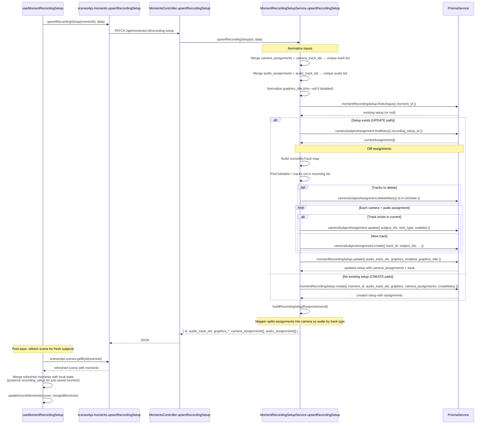
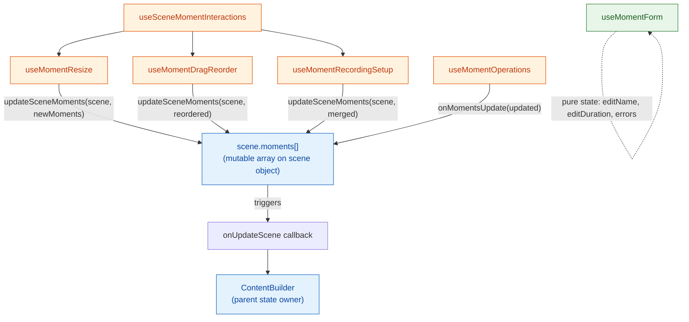

# content/moments — Deep Logic Analysis

> Enhanced analysis generated from actual source code.
> Companion to the auto-generated [content-moments.md](content-moments.md) structure diagram.

---

## Request Flow Sequences

### 1. Create Moment (with auto-subject assignment)

This is the most complex operation — it validates the scene, creates the moment, then auto-populates subject assignments from the parent package.



### 2. Save Moment (name/duration change from popover)

Shows the optimistic-update-first pattern used by `useMomentOperations`:



### 3. Upsert Recording Setup

The most complex single operation — handles create vs update, camera+audio assignment diffing, and track deletion.



---

## Business Logic Notes

### Validation Rules

| Layer | Rule | Effect |
|-------|------|--------|
| DTO | `name` — `@IsString() @IsNotEmpty()` | 400 if missing or empty |
| DTO | `duration` — `@Min(1)` | 400 if ≤ 0 |
| DTO | `order_index` — `@Min(0)` | 400 if negative |
| DTO | `source_activity_id` — `@IsInt() @IsOptional()` | 400 if present but non-integer |
| Service | Scene must exist (findUnique check) | 404 NotFoundException |
| Service | Moment must exist for update/delete | 404 NotFoundException |
| Frontend | `useMomentForm` validates name non-empty | Inline error message |
| Frontend | API call skipped if `!scene.id` | Silent no-op (unsaved scene) |
| Frontend | API call skipped if name AND duration are unchanged | Optimisation — no network call |

### Side Effects

1. **Auto-subject population on create:** When a moment is created, the service looks up the parent film's package → package subjects → and creates `FilmSceneMomentSubject` records linking each subject to the moment. If `source_activity_id` is provided, it also looks up template `subject_actions` from `PackageActivityMoment` and pre-populates `action_description` per subject role.

2. **Recording setup assignment diffing:** On upsert, existing camera assignments are diff'd against incoming data. Removed tracks → `deleteMany`. Existing tracks → updated in-place (preserving IDs). New tracks → created. This avoids recreating all assignments on each save.

3. **Reorder uses parallel updates:** `reorderMoments()` fires `Promise.all` on individual `sceneMoment.update` calls — not a transaction. Race condition is unlikely since it's called once per reorder gesture, but worth noting there's no `$transaction` wrapper.

4. **Recording setup mapper splits by track type:** `buildRecordingSetupResponse()` takes the unified `camera_assignments` from DB and splits them into `camera_assignments` (non-audio) and `audio_assignments` (track.type === 'AUDIO') in the API response.

5. **Cascade delete:** `SceneMoment` has `onDelete: Cascade` from `FilmScene`. Deleting a scene deletes all its moments and their recording setups automatically via Prisma's cascade.

### Error Handling

| Scenario | Response |
|----------|----------|
| Scene not found (create, findAll, reorder) | 404 `Scene with ID ${id} not found` |
| Moment not found (findOne, update, remove, recording-setup) | 404 `Moment with ID ${id} not found` |
| Delete recording setup when none exists | 200 `{ message: 'Moment recording setup not found' }` (not 404!) |
| Duplicate order_index | Prisma unique constraint error (@@unique on [film_scene_id, order_index]) — unhandled, bubbles as 500 |
| Frontend API failure | `console.error` in catch block, no retry or toast |

---

## State Management Flow

### No React Query — Direct Mutation Pattern

The moments feature does **not** use React Query for server state management. Instead, it uses a **direct mutation + local state** pattern:



**Key pattern:** Moments are stored as a `moments[]` array directly on the `TimelineScene` object. Hooks mutate this array and call `updateSceneMoments(scene, newMoments)` which:
1. Directly assigns `scene.moments = nextMoments` (mutation!)
2. Calls `onUpdateScene({ ...scene, moments })` to propagate up

**Why no React Query?** Moments are deeply nested (Film → Scene → Moment) and tightly coupled to the ContentBuilder's timeline state. The ContentBuilder owns the full scene tree, so individual moment queries would cause sync issues.

### Hook Dependency Graph

```
useSceneMomentInteractions (orchestrator)
  ├── useMomentResize        — pixel drag → duration calc → updateSceneMoments
  ├── useMomentDragReorder   — drag/drop → splice + reindex → updateSceneMoments
  └── useMomentRecordingSetup — API save → refetch scene → merge → updateSceneMoments

useMomentOperations (standalone — used by popover)
  └── momentsApi.update() — only if name/duration actually changed

useMomentForm (pure state — no API calls)
  └── manages editName, editDuration, errors, trackIsAssigned
```

---

## Data Transformation Map

### Create moment: DTO → DB → Response

```
Frontend CreateMomentInput          Backend CreateMomentDto              DB (sceneMoment.create)
─────────────────────────           ─────────────────────                ───────────────────────
{ name, duration?, order_index?,    { film_scene_id (from URL),         { film_scene_id,
  source_activity_id? }               name, duration?, order_index?,      name,
                                       source_activity_id? }              order_index (resolved),
                                                                          duration (default: 60),
API binding applies defaults:                                             source_activity_id }
  duration ?? 10 (FE default)
  order_index ?? 0 (FE default)
                                                                        ↓
                                    MomentResponseDto (mapper)          Prisma result
                                    ────────────────────────            ─────────────
                                    { id, film_scene_id, name,         { id, film_scene_id, name,
                                      order_index, duration,             order_index, duration,
                                      created_at, updated_at }          source_activity_id,
                                                                         created_at, updated_at }
                                    NOTE: source_activity_id
                                    is STRIPPED by mapper!
```

**Key discrepancy:** Frontend default duration is `10` seconds, backend default is `60` seconds. If the frontend sends `duration: undefined`, it falls through to `data.duration ?? 10` in the API binding, so the backend default of 60 is never reached.

### findAll: DB → Enriched response

```
DB (sceneMoment.findMany with includes)      Controller response (per moment)
────────────────────────────────────         ────────────────────────────────
{ id, film_scene_id, name,                  { id, film_scene_id, name,
  order_index, duration,                      order_index, duration,
  created_at, updated_at,                     created_at, updated_at,
  recording_setup: {                          has_recording_setup: boolean,  ← ADDED
    id, audio_track_ids,                      has_music: boolean,            ← ADDED
    graphics_enabled, graphics_title,         recording_setup: {             ← RESHAPED
    camera_assignments: [{                      id, audio_track_ids,
      track_id, subject_ids, track: {...}       graphics_enabled, graphics_title,
    }]                                          camera_assignments: [{
  },                                              track_id, track_name,      ← ADDED from track.name
  moment_music: { id, music_type }                track_type,                ← ADDED from track.type
}                                                 subject_ids, shot_type
                                                }]
                                              } | null
                                            }
```

### findOne vs findAll: Different response shapes

| Field | findAll | findOne |
|-------|---------|---------|
| `scene_name` | ✗ | ✓ (from film_scene.name) |
| `has_recording_setup` | ✓ (boolean) | ✗ |
| `has_music` | ✓ (boolean) | ✗ |
| `recording_setup.camera_assignments` | Full array with track names | `camera_assignments_count` (number only!) |
| `music` | ✗ | `{ id, music_type }` |

### Recording setup response (via buildRecordingSetupResponse)

```
DB MomentRecordingSetup                        API Response
──────────────────────                         ────────────
{ id,                                          { id,
  audio_track_ids: number[],                     audio_track_ids: number[],
  graphics_enabled: boolean,                     graphics_enabled: boolean,
  graphics_title: string | null,                 graphics_title: string | null,
  camera_assignments: [                          camera_assignments: [        ← FILTERED (non-audio only)
    { id, track_id, subject_ids,                   { id, track_id,
      track: { name, type } }                        track_name,              ← FLATTENED from track.name
  ]                                                  track_type,              ← FLATTENED from track.type
}                                                    subject_ids,
                                                     shot_type, enabled }
                                                 ],
                                                 audio_assignments: [         ← SPLIT OUT (audio tracks only)
                                                   { id, track_id,
                                                     track_name,
                                                     subject_ids }
                                                 ]
                                               }
```
