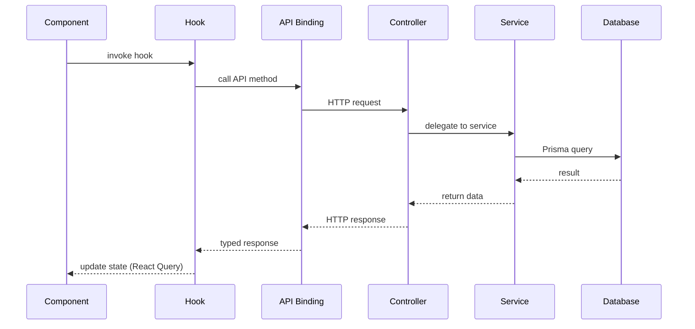
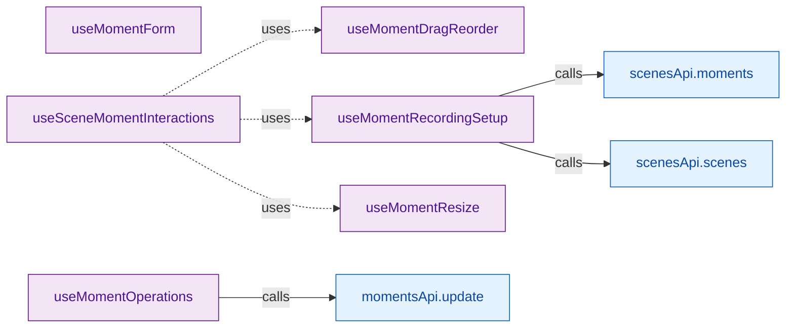
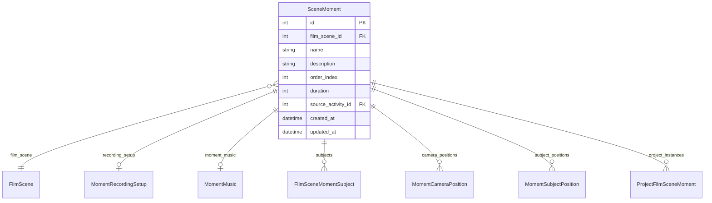

# content/moments — Feature Diagram

> Auto-generated by `tools/visualize-feature.js` on 12/04/2026, 22:56:41

## Files Analyzed

**Backend** (`packages/backend/src/content/moments/`)
- moments.controller.ts
- moment-recording-setup.service.ts
- moments-crud.service.ts
- dto/create-moment.dto.ts
- dto/update-moment.dto.ts

**Frontend** (`packages/frontend/src/features/content/moments/`)
- api/index.ts
- hooks/useMomentDragReorder.ts
- hooks/useMomentForm.ts
- hooks/useMomentOperations.ts
- hooks/useMomentRecordingSetup.ts
- hooks/useMomentResize.ts
- hooks/useSceneMomentInteractions.ts
- components/MomentsManagement

## Architecture Flow

```mermaid
graph TB
    classDef fe fill:#e3f2fd,stroke:#1565c0,color:#0d47a1
    classDef be fill:#fff3e0,stroke:#e65100,color:#bf360c
    classDef db fill:#e8f5e9,stroke:#2e7d32,color:#1b5e20
    classDef hk fill:#f3e5f5,stroke:#6a1b9a,color:#4a148c

    subgraph FE["Frontend"]
        direction TB
        subgraph Comps["Components"]
            C0["MomentsManagement"]
        end
        subgraph HooksG["Hooks"]
            H0["useMomentDragReorder"]
            H1["useMomentForm"]
            H2["useMomentOperations"]
            H3["useMomentRecordingSetup"]
            H4["useMomentResize"]
            H5["useSceneMomentInteractions"]
        end
        subgraph ApiG["API Bindings"]
            A0["getSceneMoments()"]
            A1["getById()"]
            A2["create()"]
            A3["update()"]
            A4["delete()"]
            A5["getRecordingSetup()"]
        end
    end

    subgraph BE["Backend"]
        direction TB
        subgraph Ctrl["Controller"]
            E0["POST /api/moments/scenes/:sceneId/moments"]
            E1["GET /api/moments/scenes/:sceneId/moments"]
            E2["GET /api/moments/:id"]
            E3["GET /api/moments/:id/recording-setup"]
            E4["PATCH /api/moments/:id"]
            E5["PATCH /api/moments/:id/recording-setup"]
            E6["DELETE /api/moments/:id"]
            E7["DELETE /api/moments/:id/recording-setup"]
            E8["POST /api/moments/scenes/:sceneId/reorder"]
        end
        subgraph Svcs["Services"]
            S0["MomentRecordingSetupService"]
            S1["MomentsCrudService"]
        end
    end

    DB[("SceneMoment")]

    H2 --> A3
    H5 -.-> H4
    H5 -.-> H0
    H5 -.-> H3
    A0 -->|"GET"| E1
    A1 -->|"GET"| E2
    A2 -->|"POST"| E0
    A3 -->|"PATCH"| E4
    A4 -->|"DELETE"| E6
    A5 -->|"GET"| E3
    E0 --> S1
    E1 --> S1
    E2 --> S1
    E3 --> S0
    E4 --> S1
    E5 --> S0
    E6 --> S1
    E7 --> S0
    E8 --> S1
    S0 --> DB
    S1 --> DB
    class C0 fe
    class H0 hk
    class H1 hk
    class H2 hk
    class H3 hk
    class H4 hk
    class H5 hk
    class A0 fe
    class A1 fe
    class A2 fe
    class A3 fe
    class A4 fe
    class A5 fe
    class E0 be
    class E1 be
    class E2 be
    class E3 be
    class E4 be
    class E5 be
    class E6 be
    class E7 be
    class E8 be
    class S0 be
    class S1 be
    class DB db

```

## Request Flow (Generic)

## API Endpoints

| Method | Path | Handler |
|--------|------|---------|
| `POST` | `/api/moments/scenes/:sceneId/moments` | `create()` |
| `GET` | `/api/moments/scenes/:sceneId/moments` | `findAll()` |
| `GET` | `/api/moments/:id` | `findOne()` |
| `GET` | `/api/moments/:id/recording-setup` | `getRecordingSetup()` |
| `PATCH` | `/api/moments/:id` | `update()` |
| `PATCH` | `/api/moments/:id/recording-setup` | `upsertRecordingSetup()` |
| `DELETE` | `/api/moments/:id` | `remove()` |
| `DELETE` | `/api/moments/:id/recording-setup` | `deleteRecordingSetup()` |
| `POST` | `/api/moments/scenes/:sceneId/reorder` | `reorderMoments()` |

## Backend Services

### MomentRecordingSetupService

| Method | Async |
|--------|-------|
| `getRecordingSetup()` | ✓ |
| `upsertRecordingSetup()` | ✓ |
| `deleteRecordingSetup()` | ✓ |

### MomentsCrudService

| Method | Async |
|--------|-------|
| `create()` | ✓ |
| `findAll()` | ✓ |
| `findOne()` | ✓ |
| `update()` | ✓ |
| `remove()` | ✓ |
| `reorderMoments()` | ✓ |

## Frontend Hooks

| Hook | API Calls | Hook Dependencies |
|------|-----------|-------------------|
| `useMomentDragReorder` | — | — |
| `useMomentForm` | — | — |
| `useMomentOperations` | `momentsApi.update` | — |
| `useMomentRecordingSetup` | `scenesApi.moments`, `scenesApi.scenes` | — |
| `useMomentResize` | — | — |
| `useSceneMomentInteractions` | — | `useMomentResize`, `useMomentDragReorder`, `useMomentRecordingSetup` |

## Data Model: SceneMoment

### Fields

| Field | Type | PK | FK | Optional |
|-------|------|----|----|----------|
| `id` | Int | ✓ |  |  |
| `film_scene_id` | Int |  | ✓ |  |
| `name` | String |  |  |  |
| `description` | String |  |  | ✓ |
| `order_index` | Int |  |  |  |
| `duration` | Int |  |  |  |
| `source_activity_id` | Int |  | ✓ | ✓ |
| `created_at` | DateTime |  |  |  |
| `updated_at` | DateTime |  |  |  |

### Relations

| Relation | Type | Cardinality |
|----------|------|-------------|
| `film_scene` | FilmScene | 1:1 |
| `recording_setup` | MomentRecordingSetup | 0..1 |
| `moment_music` | MomentMusic | 0..1 |
| `subjects` | FilmSceneMomentSubject | 1:many |
| `camera_positions` | MomentCameraPosition | 1:many |
| `subject_positions` | MomentSubjectPosition | 1:many |
| `project_instances` | ProjectFilmSceneMoment | 1:many |

### Other Referenced Models

- MomentRecordingSetup
- CameraSubjectAssignment
- FilmScene
- PackageFilm
- PackageDaySubject
- PackageActivityMoment
- FilmSceneMomentSubject

## DTOs

### CreateMomentDto

| Field | Type | Validators |
|-------|------|------------|
| `film_scene_id` | `number` | @IsNumber, @IsOptional |
| `name` | `string` | @IsString, @IsNotEmpty |
| `order_index` | `number` | @IsNumber, @IsOptional, @Min |
| `duration` | `number` | @IsNumber, @IsOptional, @Min |
| `source_activity_id` | `number` | @IsInt, @IsOptional |

### UpdateMomentDto

| Field | Type | Validators |
|-------|------|------------|
| `name` | `string` | @IsString, @IsOptional |
| `description` | `string` | @IsString, @IsOptional |
| `order_index` | `number` | @IsNumber, @IsOptional, @Min |
| `duration` | `number` | @IsNumber, @IsOptional, @Min |

