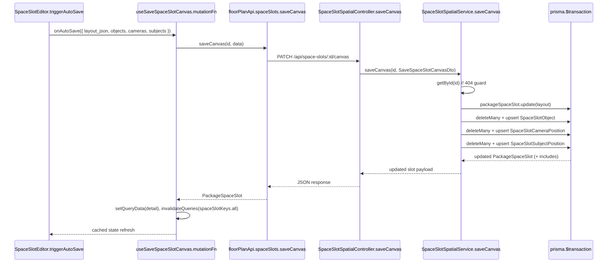
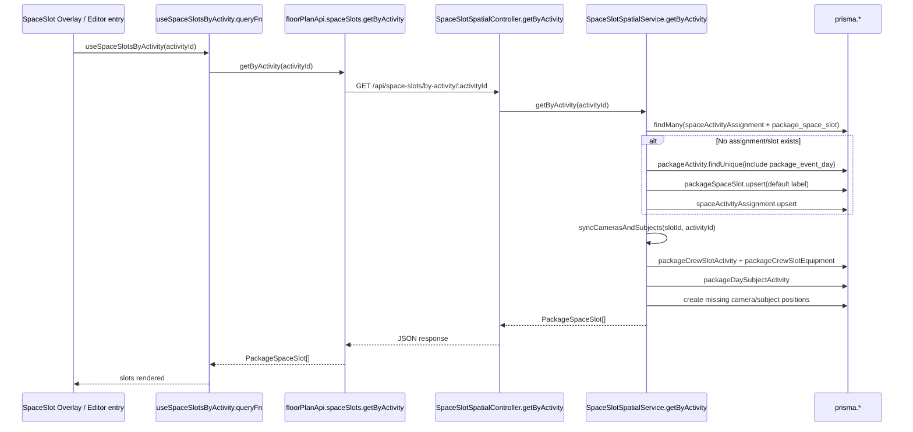
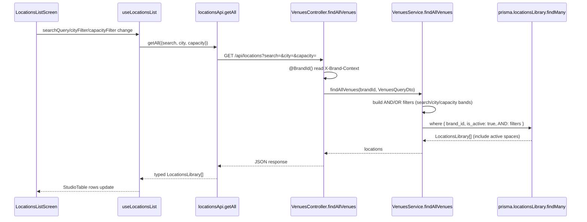

# workflow/locations — Deep Logic Analysis

> Note: requested argument was `spaceslots`, which is not a valid `bucket/feature` key for `tools/visualize-feature.js`. This analysis maps to `workflow/locations`, where space-slot APIs/hooks/controllers are implemented.

## Request Flow Sequences

### 1) Auto-save Space Slot Canvas (objects/cameras/subjects)

### 2) Load Slots by Activity with Lazy Creation + Sync

### 3) Filtered Locations List (brand-scoped)

## Business Logic Notes

- Brand scoping is enforced in listing flow through `@BrandId()` in `VenuesController.findAllVenues`, then applied in `VenuesService.findAllVenues` (`where.brand_id = brandId`).
- Location and space deletion is soft-delete, not hard-delete:
  - `removeVenue` sets `is_active=false`.
  - `removeSpace` sets `is_active=false`.
- `SpaceSlotSpatialService.getByActivity` has side effects on read:
  - If no slot assignment exists, it lazily creates a default `PackageSpaceSlot` and `SpaceActivityAssignment`.
  - It then syncs dependent camera/subject positions from crew/day-subject activity assignments.
- `saveCanvas` is transactional and uses replacement semantics per collection:
  - Any DB child rows not present in incoming `id` set are deleted (`deleteMany ... notIn keepIds`).
  - Existing rows are updated, new rows are created.
- Zone/anchor bulk upserts also use replacement semantics:
  - `upsertZones` and `upsertAnchors` delete omitted rows, then update/create remaining payload entries.
- Moment overrides are keyframe-style upserts on compound unique keys:
  - Cameras: `(camera_position_id, moment_id)`
  - Subjects: `(subject_position_id, moment_id)`
- Error handling pattern:
  - Missing entities trigger `NotFoundException` (slot/space/venue).
  - Canvas save and upsert flows call guard methods (`getById`, venue lookup) before mutation.

## State Management Flow

- API surface:
  - `locationsApi` and `floorPlanApi` are the only feature API clients.
  - Both use shared `apiClient` -> `request()`.
- Auth + tenant context propagation:
  - Shared request layer injects `Authorization` and `X-Brand-Context` headers from storage.
  - 401 responses trigger refresh flow via `/api/auth/refresh` and retry once.
- Query key strategy in space-slot hooks (`useSpaceSlotSpatial.ts`):
  - Root: `spaceSlotKeys.all(brandId)`.
  - Branches: `byActivity`, `byPackage`, `detail`, `momentOverrides`, `zones`, `anchors`, `spatialContext`, `resolvedFacing`.
- Mutation cache behavior:
  - `useSaveSpaceSlotCanvas` uses `setQueryData(detail)` for immediate slot detail coherence.
  - Then broad invalidation on `spaceSlotKeys.all(brandId)` plus shot-preview overlays.
  - Position/moment override mutations rely on invalidation-only (no optimistic write-through).
- Locations list state (`useLocationsList`):
  - Query key includes brand + filter tuple (`searchQuery`, `cityFilter`, `capacityFilter`) to isolate cache entries by filter state.

## Data Transformation Map

### A) Space Slot Canvas Save

1. UI serialization:
   - `SpaceSlotEditor.triggerAutoSave()` serializes Fabric objects into `SaveSpaceSlotCanvasRequest`.
   - Derives each object shape: `dbId -> id`, `fObj.left/top -> x/y`, defaults for width/height/rotation.
2. Frontend API:
   - `floorPlanApi.spaceSlots.saveCanvas(id, data)` sends PATCH payload unchanged.
3. Backend DTO validation:
   - `SaveSpaceSlotCanvasDto` validates arrays of nested DTOs (objects/cameras/subjects) and numeric fields.
4. Service transformation:
   - Service maps optional fields to nullable columns (`?? null`) and default fields (`rotation`, `order_index`, etc.).
   - Uses delete-missing + update/create loops per collection.
5. Response enrichment:
   - Returns `PackageSpaceSlot` with includes (`objects`, `camera_positions`, `subject_positions`, `zones`, `anchors`, `type_tags`, nested relations).
6. Hook cache shape:
   - Stored directly in detail cache via `spaceSlotKeys.detail(brandId, slotId)`.

### B) Locations List Query

1. UI filter state:
   - `LocationsListScreen` maintains local `searchQuery`, `cityFilter`, `capacityFilter`.
2. Hook param normalization:
   - `useLocationsList` converts `'all'` to `undefined`, trims search.
3. API query-string mapping:
   - `locationsApi.getAll` builds `URLSearchParams`.
4. Backend query DTO:
   - `VenuesQueryDto` validates incoming filter fields.
5. Service filter construction:
   - Search => OR across name/city/state/contact/address/postcode.
   - Capacity buckets => numeric predicates (`<100`, `100..200`, `>200`, `null`).
6. Response model:
   - Returns `LocationsLibrary[]` with included active spaces and `type_tags`.

### C) Spatial Context for AI

1. Request:
   - `GET /api/space-slots/:slotId/spatial-context?momentId=`
2. Service assembly (`buildSpatialContext`):
   - Loads slot with includes.
   - Computes resolved facing via `resolveAllFacing`.
   - Applies moment overrides (if `momentId`) for cameras/subjects.
3. Output shape:
   - Purpose-built AI payload with `canvas`, `zones`, `anchors`, `objects`, `cameras`, `subjects`.
   - This is an enriched projection, not a direct ORM echo.

## Source References

- Backend controllers/services:
  - `packages/backend/src/workflow/locations/modules/floor-plans/space-slot-spatial.controller.ts`
  - `packages/backend/src/workflow/locations/modules/floor-plans/space-slot-spatial.service.ts`
  - `packages/backend/src/workflow/locations/modules/venues/venues.controller.ts`
  - `packages/backend/src/workflow/locations/modules/venues/venues.service.ts`
- Backend DTOs:
  - `packages/backend/src/workflow/locations/modules/floor-plans/dto/space-slot-spatial.dto.ts`
- Frontend API/hooks/components/types:
  - `packages/frontend/src/features/workflow/locations/api/locations.api.ts`
  - `packages/frontend/src/features/workflow/locations/api/floor-plan.api.ts`
  - `packages/frontend/src/features/workflow/locations/hooks/useSpaceSlotSpatial.ts`
  - `packages/frontend/src/features/workflow/locations/hooks/useLocationsList.ts`
  - `packages/frontend/src/features/workflow/locations/components/floor-plan/components/Editor/SpaceSlotEditor.tsx`
  - `packages/frontend/src/features/workflow/locations/types/floor-plan.types.ts`
- Shared client infra:
  - `packages/frontend/src/shared/api/client/request.ts`
