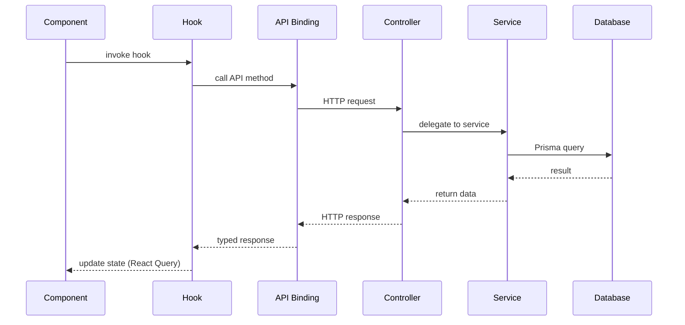
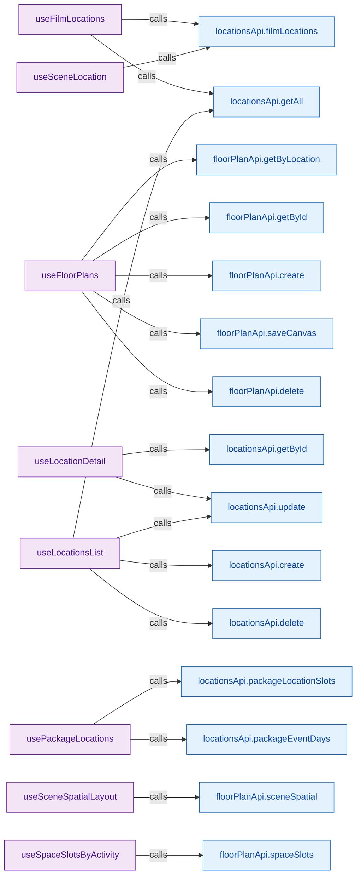
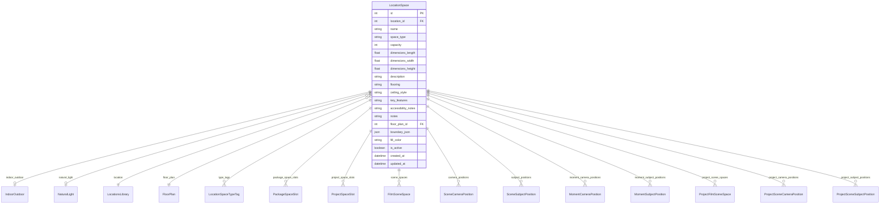

# workflow/locations — Feature Diagram

> Auto-generated by `tools/visualize-feature.js` on 12/04/2026, 23:02:10

## Files Analyzed

**Backend** (`packages/backend/src/workflow/locations/`)
- modules\floor-plans\floor-plans.controller.ts
- modules\floor-plans\space-slot-spatial.controller.ts
- modules\venues\venues.controller.ts
- geocoding.service.ts
- modules\floor-plans\floor-plans.service.ts
- modules\floor-plans\space-slot-spatial.service.ts
- modules\venues\venues.service.ts
- dto/create-location.dto.ts
- dto/location.dto.ts
- dto/update-location.dto.ts
- dto/venues-query.dto.ts

**Frontend** (`packages/frontend/src/features/workflow/locations/`)
- api/floor-plan.api.ts
- api/geocoding.api.ts
- api/index.ts
- api/locations.api.ts
- hooks/useFilmLocations.ts
- hooks/useFloorPlan.ts
- hooks/useLocationDetail.ts
- hooks/useLocationsList.ts
- hooks/usePackageLocations.ts
- hooks/useSceneLocation.ts
- hooks/useSceneSpatial.ts
- hooks/useSpaceSlotSpatial.ts
- components/LocationAddressCard
- components/LocationContactCard
- components/LocationCreateDialog
- components/LocationDetailPanel
- components/LocationsMap

## Architecture Flow

```mermaid
graph TB
    classDef fe fill:#e3f2fd,stroke:#1565c0,color:#0d47a1
    classDef be fill:#fff3e0,stroke:#e65100,color:#bf360c
    classDef db fill:#e8f5e9,stroke:#2e7d32,color:#1b5e20
    classDef hk fill:#f3e5f5,stroke:#6a1b9a,color:#4a148c

    subgraph FE["Frontend"]
        direction TB
        subgraph Comps["Components"]
            C0["LocationAddressCard"]
            C1["LocationContactCard"]
            C2["LocationCreateDialog"]
            C3["LocationDetailPanel"]
            C4["LocationsMap"]
        end
        subgraph HooksG["Hooks"]
            H0["useFilmLocations"]
            H1["useFloorPlans"]
            H2["useLocationDetail"]
            H3["useLocationsList"]
            H4["usePackageLocations"]
            H5["useSceneLocation"]
            H6["useSceneSpatialLayout"]
            H7["useSpaceSlotsByActivity"]
        end
        subgraph ApiG["API Bindings"]
            A0["getByLocation()"]
            A1["getById()"]
            A2["create()"]
            A3["update()"]
            A4["delete()"]
            A5["saveCanvas()"]
            A6["createObject()"]
            A7["updateObject()"]
            A8["deleteObject()"]
            A9["updateSpaceBoundary()"]
            A10["getLayout()"]
            A11["getSpaces()"]
            A12["addSpace()"]
            A13["removeSpace()"]
            A14["getCameras()"]
            A15["upsertCamera()"]
            A16["removeCamera()"]
            A17["getSubjects()"]
            A18["upsertSubject()"]
            A19["removeSubject()"]
            A20["getMomentLayout()"]
            A21["getMomentCameras()"]
            A22["upsertMomentCamera()"]
            A23["removeMomentCamera()"]
            A24["getMomentSubjects()"]
            A25["upsertMomentSubject()"]
            A26["removeMomentSubject()"]
            A27["getByActivity()"]
            A28["getById()"]
            A29["getByPackage()"]
            A30["saveCanvas()"]
            A31["updateCameraPosition()"]
            A32["updateSubjectPosition()"]
            A33["getMomentOverrides()"]
            A34["upsertMomentCamera()"]
            A35["upsertMomentSubject()"]
            A36["getZones()"]
            A37["upsertZones()"]
            A38["getAnchors()"]
            A39["upsertAnchors()"]
            A40["getSpatialContext()"]
            A41["getResolvedFacing()"]
            A42["getAll()"]
            A43["create()"]
            A44["update()"]
            A45["delete()"]
            A46["getAll()"]
            A47["create()"]
            A48["update()"]
            A49["delete()"]
            A50["getByFilm()"]
            A51["addToFilm()"]
            A52["removeFromFilm()"]
            A53["getSceneLocation()"]
            A54["setSceneLocation()"]
            A55["clearSceneLocation()"]
            A56["getAll()"]
            A57["getAll()"]
        end
    end

    subgraph BE["Backend"]
        direction TB
        subgraph Ctrl["Controller"]
            E0["GET /api/locations/:locationId/floor-plans"]
            E1["POST /api/locations/:locationId/floor-plans"]
            E2["GET /api/locations/:locationId/floor-plans/:id"]
            E3["PATCH /api/locations/:locationId/floor-plans/:id"]
            E4["DELETE /api/locations/:locationId/floor-plans/:id"]
            E5["PATCH /api/locations/:locationId/floor-plans/:id/canvas"]
            E6["POST /api/locations/:locationId/floor-plans/:id/objects"]
            E7["PATCH /api/locations/:locationId/floor-plans/objects/:objectId"]
            E8["DELETE /api/locations/:locationId/floor-plans/objects/:objectId"]
            E9["PATCH /api/locations/:locationId/floor-plans/:id/spaces/:spaceId/boundary"]
            E10["GET /api/space-slots/by-activity/:activityId"]
            E11["GET /api/space-slots/by-package/:packageId"]
            E12["GET /api/space-slots/:id"]
            E13["PATCH /api/space-slots/:id/canvas"]
            E14["PATCH /api/space-slots/cameras/:id/position"]
            E15["PATCH /api/space-slots/subjects/:id/position"]
            E16["GET /api/space-slots/:slotId/moments/:momentId"]
            E17["PUT /api/space-slots/moment-cameras/:cameraPositionId/:momentId"]
            E18["PUT /api/space-slots/moment-subjects/:subjectPositionId/:momentId"]
            E19["GET /api/space-slots/:slotId/zones"]
            E20["PUT /api/space-slots/:slotId/zones"]
            E21["GET /api/space-slots/:slotId/anchors"]
            E22["PUT /api/space-slots/:slotId/anchors"]
            E23["GET /api/space-slots/:slotId/spatial-context"]
            E24["GET /api/space-slots/:slotId/resolved-facing"]
            E25["POST /api/locations"]
            E26["GET /api/locations"]
            E27["GET /api/locations/:id"]
            E28["PATCH /api/locations/:id"]
            E29["DELETE /api/locations/:id"]
            E30["GET /api/locations/:locationId/spaces"]
            E31["POST /api/locations/:locationId/spaces"]
            E32["PATCH /api/locations/spaces/:spaceId"]
            E33["DELETE /api/locations/spaces/:spaceId"]
        end
        subgraph Svcs["Services"]
            S0["GeocodingService"]
            S1["FloorPlansService"]
            S2["SpaceSlotSpatialService"]
            S3["VenuesService"]
        end
    end

    DB[("LocationSpace")]

    H0 --> A42
    H1 --> A0
    H1 --> A1
    H1 --> A2
    H1 --> A5
    H1 --> A4
    H2 --> A1
    H2 --> A3
    H3 --> A42
    H3 --> A3
    H3 --> A2
    H3 --> A4
    A0 -->|"GET"| E0
    A1 -->|"GET"| E2
    A2 -->|"POST"| E1
    A3 -->|"PATCH"| E3
    A4 -->|"DELETE"| E4
    A5 -->|"PATCH"| E5
    A6 -->|"POST"| E6
    A7 -->|"PATCH"| E7
    A8 -->|"DELETE"| E8
    A9 -->|"PATCH"| E9
    A27 -->|"GET"| E10
    A28 -->|"GET"| E12
    A29 -->|"GET"| E11
    A30 -->|"PATCH"| E13
    A31 -->|"PATCH"| E14
    A32 -->|"PATCH"| E15
    A33 -->|"GET"| E16
    A34 -->|"PUT"| E17
    A35 -->|"PUT"| E18
    A36 -->|"GET"| E19
    A37 -->|"PUT"| E20
    A38 -->|"GET"| E21
    A39 -->|"PUT"| E22
    A41 -->|"GET"| E24
    A42 -->|"GET"| E27
    A43 -->|"POST"| E25
    A44 -->|"PATCH"| E28
    A45 -->|"DELETE"| E29
    A46 -->|"GET"| E30
    A47 -->|"POST"| E31
    A48 -->|"PATCH"| E32
    A49 -->|"DELETE"| E33
    A50 -->|"GET"| E26
    A51 -->|"POST"| E25
    A52 -->|"DELETE"| E29
    E0 --> S1
    E1 --> S1
    E2 --> S1
    E3 --> S1
    E4 --> S1
    E5 --> S1
    E6 --> S1
    E7 --> S1
    E8 --> S1
    E9 --> S1
    E10 --> S2
    E11 --> S2
    E12 --> S2
    E13 --> S2
    E14 --> S2
    E15 --> S2
    E16 --> S2
    E17 --> S2
    E18 --> S2
    E19 --> S2
    E20 --> S2
    E21 --> S2
    E22 --> S2
    E23 --> S2
    E24 --> S2
    E25 --> S3
    E26 --> S3
    E27 --> S3
    E28 --> S3
    E29 --> S3
    E30 --> S3
    E31 --> S3
    E32 --> S3
    E33 --> S3
    S0 --> DB
    S1 --> DB
    S2 --> DB
    S3 --> DB
    class C0 fe
    class C1 fe
    class C2 fe
    class C3 fe
    class C4 fe
    class H0 hk
    class H1 hk
    class H2 hk
    class H3 hk
    class H4 hk
    class H5 hk
    class H6 hk
    class H7 hk
    class A0 fe
    class A1 fe
    class A2 fe
    class A3 fe
    class A4 fe
    class A5 fe
    class A6 fe
    class A7 fe
    class A8 fe
    class A9 fe
    class A10 fe
    class A11 fe
    class A12 fe
    class A13 fe
    class A14 fe
    class A15 fe
    class A16 fe
    class A17 fe
    class A18 fe
    class A19 fe
    class A20 fe
    class A21 fe
    class A22 fe
    class A23 fe
    class A24 fe
    class A25 fe
    class A26 fe
    class A27 fe
    class A28 fe
    class A29 fe
    class A30 fe
    class A31 fe
    class A32 fe
    class A33 fe
    class A34 fe
    class A35 fe
    class A36 fe
    class A37 fe
    class A38 fe
    class A39 fe
    class A40 fe
    class A41 fe
    class A42 fe
    class A43 fe
    class A44 fe
    class A45 fe
    class A46 fe
    class A47 fe
    class A48 fe
    class A49 fe
    class A50 fe
    class A51 fe
    class A52 fe
    class A53 fe
    class A54 fe
    class A55 fe
    class A56 fe
    class A57 fe
    class E0 be
    class E1 be
    class E2 be
    class E3 be
    class E4 be
    class E5 be
    class E6 be
    class E7 be
    class E8 be
    class E9 be
    class E10 be
    class E11 be
    class E12 be
    class E13 be
    class E14 be
    class E15 be
    class E16 be
    class E17 be
    class E18 be
    class E19 be
    class E20 be
    class E21 be
    class E22 be
    class E23 be
    class E24 be
    class E25 be
    class E26 be
    class E27 be
    class E28 be
    class E29 be
    class E30 be
    class E31 be
    class E32 be
    class E33 be
    class S0 be
    class S1 be
    class S2 be
    class S3 be
    class DB db

```

## Request Flow (Generic)

## API Endpoints

| Method | Path | Handler |
|--------|------|---------|
| `GET` | `/api/locations/:locationId/floor-plans` | `findByLocation()` |
| `POST` | `/api/locations/:locationId/floor-plans` | `create()` |
| `GET` | `/api/locations/:locationId/floor-plans/:id` | `findById()` |
| `PATCH` | `/api/locations/:locationId/floor-plans/:id` | `update()` |
| `DELETE` | `/api/locations/:locationId/floor-plans/:id` | `remove()` |
| `PATCH` | `/api/locations/:locationId/floor-plans/:id/canvas` | `saveCanvas()` |
| `POST` | `/api/locations/:locationId/floor-plans/:id/objects` | `createObject()` |
| `PATCH` | `/api/locations/:locationId/floor-plans/objects/:objectId` | `updateObject()` |
| `DELETE` | `/api/locations/:locationId/floor-plans/objects/:objectId` | `removeObject()` |
| `PATCH` | `/api/locations/:locationId/floor-plans/:id/spaces/:spaceId/boundary` | `updateSpaceBoundary()` |
| `GET` | `/api/space-slots/by-activity/:activityId` | `getByActivity()` |
| `GET` | `/api/space-slots/by-package/:packageId` | `getByPackage()` |
| `GET` | `/api/space-slots/:id` | `getById()` |
| `PATCH` | `/api/space-slots/:id/canvas` | `saveCanvas()` |
| `PATCH` | `/api/space-slots/cameras/:id/position` | `updateCameraPosition()` |
| `PATCH` | `/api/space-slots/subjects/:id/position` | `updateSubjectPosition()` |
| `GET` | `/api/space-slots/:slotId/moments/:momentId` | `getMomentOverrides()` |
| `PUT` | `/api/space-slots/moment-cameras/:cameraPositionId/:momentId` | `upsertMomentCamera()` |
| `PUT` | `/api/space-slots/moment-subjects/:subjectPositionId/:momentId` | `upsertMomentSubject()` |
| `GET` | `/api/space-slots/:slotId/zones` | `getZones()` |
| `PUT` | `/api/space-slots/:slotId/zones` | `upsertZones()` |
| `GET` | `/api/space-slots/:slotId/anchors` | `getAnchors()` |
| `PUT` | `/api/space-slots/:slotId/anchors` | `upsertAnchors()` |
| `GET` | `/api/space-slots/:slotId/spatial-context` | `getSpatialContext()` |
| `GET` | `/api/space-slots/:slotId/resolved-facing` | `getResolvedFacing()` |
| `POST` | `/api/locations` | `createVenue()` |
| `GET` | `/api/locations` | `findAllVenues()` |
| `GET` | `/api/locations/:id` | `findVenueById()` |
| `PATCH` | `/api/locations/:id` | `updateVenue()` |
| `DELETE` | `/api/locations/:id` | `removeVenue()` |
| `GET` | `/api/locations/:locationId/spaces` | `getSpaces()` |
| `POST` | `/api/locations/:locationId/spaces` | `createSpace()` |
| `PATCH` | `/api/locations/spaces/:spaceId` | `updateSpace()` |
| `DELETE` | `/api/locations/spaces/:spaceId` | `removeSpace()` |

## Backend Services

### GeocodingService

| Method | Async |
|--------|-------|
| `geocodeAddress()` | ✓ |

### FloorPlansService

### SpaceSlotSpatialService

### VenuesService

| Method | Async |
|--------|-------|
| `createVenue()` | ✓ |
| `findAllVenues()` | ✓ |
| `findVenueById()` | ✓ |
| `updateVenue()` | ✓ |
| `removeVenue()` | ✓ |
| `getSpaces()` | ✓ |
| `createSpace()` | ✓ |
| `updateSpace()` | ✓ |
| `removeSpace()` | ✓ |

## Frontend Hooks

| Hook | API Calls | Hook Dependencies |
|------|-----------|-------------------|
| `useFilmLocations` | `locationsApi.filmLocations`, `locationsApi.getAll` | `useQueryClient`, `useBrand`, `useQuery`, `useMutation` |
| `useFloorPlans` | `floorPlanApi.getByLocation`, `floorPlanApi.getById`, `floorPlanApi.create`, `floorPlanApi.saveCanvas`, `floorPlanApi.delete` | `useBrand`, `useQuery`, `useFloorPlan`, `useCreateFloorPlan`, `useQueryClient`, `useMutation`, `useSaveFloorPlanCanvas`, `useDeleteFloorPlan` |
| `useLocationDetail` | `locationsApi.getById`, `locationsApi.update` | `useQueryClient`, `useQuery`, `useMutation` |
| `useLocationsList` | `locationsApi.getAll`, `locationsApi.update`, `locationsApi.create`, `locationsApi.delete` | `useBrand`, `useQueryClient`, `useQuery`, `useMutation` |
| `usePackageLocations` | `locationsApi.packageLocationSlots`, `locationsApi.packageEventDays` | `useQuery` |
| `useSceneLocation` | `locationsApi.filmLocations` | `useQueryClient`, `useQuery`, `useMutation` |
| `useSceneSpatialLayout` | `floorPlanApi.sceneSpatial` | `useBrand`, `useQuery`, `useUpsertCameraPosition`, `useQueryClient`, `useMutation`, `useUpsertSubjectPosition`, `useRemoveCameraPosition`, `useRemoveSubjectPosition`, `useMomentSpatialLayout`, `useUpsertMomentCameraPosition`, `useUpsertMomentSubjectPosition`, `useRemoveMomentCameraPosition`, `useRemoveMomentSubjectPosition` |
| `useSpaceSlotsByActivity` | `floorPlanApi.spaceSlots` | `useBrand`, `useQuery`, `useSpaceSlotsByPackage`, `useSpaceSlot`, `useSaveSpaceSlotCanvas`, `useQueryClient`, `useMutation`, `useUpdateSlotCameraPosition`, `useUpdateSlotSubjectPosition`, `useUpsertSlotMomentCamera`, `useUpsertSlotMomentSubject`, `useSpaceSlotZones`, `useUpsertSpaceSlotZones`, `useSpaceSlotAnchors`, `useUpsertSpaceSlotAnchors` |

## Data Model: LocationSpace

### Fields

| Field | Type | PK | FK | Optional |
|-------|------|----|----|----------|
| `id` | Int | ✓ |  |  |
| `location_id` | Int |  | ✓ |  |
| `name` | String |  |  |  |
| `space_type` | String |  |  | ✓ |
| `capacity` | Int |  |  | ✓ |
| `dimensions_length` | Float |  |  | ✓ |
| `dimensions_width` | Float |  |  | ✓ |
| `dimensions_height` | Float |  |  | ✓ |
| `description` | String |  |  | ✓ |
| `flooring` | String |  |  | ✓ |
| `ceiling_style` | String |  |  | ✓ |
| `key_features` | String |  |  | ✓ |
| `accessibility_notes` | String |  |  | ✓ |
| `notes` | String |  |  | ✓ |
| `floor_plan_id` | Int |  | ✓ | ✓ |
| `boundary_json` | Json |  |  | ✓ |
| `fill_color` | String |  |  | ✓ |
| `is_active` | Boolean |  |  |  |
| `created_at` | DateTime |  |  |  |
| `updated_at` | DateTime |  |  |  |

### Relations

| Relation | Type | Cardinality |
|----------|------|-------------|
| `indoor_outdoor` | IndoorOutdoor | 0..1 |
| `natural_light` | NaturalLight | 0..1 |
| `location` | LocationsLibrary | 1:1 |
| `floor_plan` | FloorPlan | 0..1 |
| `type_tags` | LocationSpaceTypeTag | 1:many |
| `package_space_slots` | PackageSpaceSlot | 1:many |
| `project_space_slots` | ProjectSpaceSlot | 1:many |
| `scene_spaces` | FilmSceneSpace | 1:many |
| `camera_positions` | SceneCameraPosition | 1:many |
| `subject_positions` | SceneSubjectPosition | 1:many |
| `moment_camera_positions` | MomentCameraPosition | 1:many |
| `moment_subject_positions` | MomentSubjectPosition | 1:many |
| `project_scene_spaces` | ProjectFilmSceneSpace | 1:many |
| `project_camera_positions` | ProjectSceneCameraPosition | 1:many |
| `project_subject_positions` | ProjectSceneSubjectPosition | 1:many |

### Other Referenced Models

- LocationsLibrary
- FloorPlan
- PackageSpaceSlot
- SpaceSlotCameraPosition
- SpaceSlotAnchor
- SpaceSlotSubjectPosition
- SpaceSlotZone
- FloorPlanObject
- SpaceSlotObject
- SpaceActivityAssignment
- SpaceSlotMomentCamera
- SpaceSlotMomentSubject
- PackageActivity
- PackageCrewSlotActivity
- PackageCrewSlotEquipment
- PackageDaySubjectActivity
- FloorPlanPreset
- PackageSpaceSlotTypeTag

## DTOs

### CreateLocationDto

| Field | Type | Validators |
|-------|------|------------|
| `name` | `string` | @IsString |
| `address_line1` | `string` | @IsOptional, @IsString |
| `address_line2` | `string` | @IsOptional, @IsString |
| `city` | `string` | @IsOptional, @IsString |
| `state` | `string` | @IsOptional, @IsString |
| `country` | `string = 'United States'` | @IsOptional, @IsString |
| `postal_code` | `string` | @IsOptional, @IsString |
| `lat` | `number` | @IsOptional, @IsNumber |
| `lng` | `number` | @IsOptional, @IsNumber |
| `precision` | `LocationPrecision` | @IsOptional, @IsEnum |
| `contact_name` | `string` | @IsOptional, @IsString |
| `contact_phone` | `string` | @IsOptional, @IsString |
| `contact_email` | `string` | @IsOptional, @IsEmail |
| `capacity` | `number` | @IsOptional, @Type, @IsInt, @Min |
| `notes` | `string` | @IsOptional, @IsString |
| `brand_id` | `number` | @IsOptional, @Type, @IsInt |
| `is_active` | `boolean = true` | @IsOptional, @Transform, @IsBoolean |

### Unknown

### UpdateLocationDto

### VenuesQueryDto

| Field | Type | Validators |
|-------|------|------------|
| `search` | `string` | @IsOptional, @IsString |
| `city` | `string` | @IsOptional, @IsString |
| `capacity` | `'small' | 'medium' | 'large' | 'unknown'` | @IsOptional, @IsString, @IsIn |

