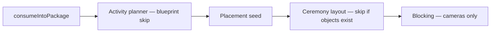

# Day Designer ↔ package boundaries

## Ownership

| Layer | Owns |
|-------|------|
| **Day Designer** (`day_blueprint_*`) | Day structure, activity/moment lists, normalized moment actions, placement hints, sandbox floor geometry at publish time |
| **Package template** | Commercial shell: template days, crew roles, equipment presets, location slots — not a competing activity/moment list when using blueprint-first creation |
| **Package instance** (`service_packages` + snapshot rows) | Runtime copy with `source_day_blueprint_*` lineage; timing, crew, equipment, and camera plans remain editable on the package |

Packages **must not** read live blueprint tables during runtime. Structure is materialized once via `DayBlueprintSnapshotService.consumeIntoPackage()` and updated only through explicit resync.

## Creation pipeline (blueprint-first)

1. **Consume** — `PackageActivity`, `PackageActivityMoment`, `package_activity_moment_actions`, sandbox slots/objects/zones; optional `contents.blueprint_day_mappings` for multi-day resync.
2. **Planner** — Skipped in blueprint mode (no `subject_actions` JSON from AI planner).
3. **Placement seed** — Subject positions from blueprint placements.
4. **Layout** — `SandboxLayoutService` skipped when snapshot already populated objects.
5. **Blocking** — Cameras only; subject positions fixed; actions loaded from `package_activity_moment_actions`.

## Actions source of truth

- **Blueprint packages:** `package_activity_moment_actions` (snapshot). `subject_actions` JSON is cleared on consume.
- **Legacy full-mode packages:** Planner may still write `subject_actions` JSON; UI falls back when normalized actions are absent.

## Multi-day resync

When the wizard supplies `blueprintDayMappings`, they are stored on `service_packages.contents.blueprint_day_mappings` and replayed on resync. Without stored mappings, resync pairs blueprint days to package event days by **order index** (single-day or unchanged template order only).

## UI

Blueprint-backed packages (`source_day_blueprint_version_id` set) show a package-detail banner and disable add/delete of activities and moments in the schedule column. Traceability to Day Designer remains via the header link.
